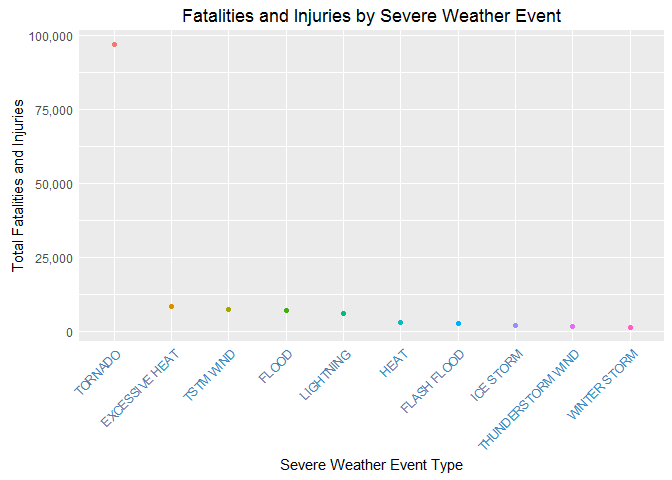
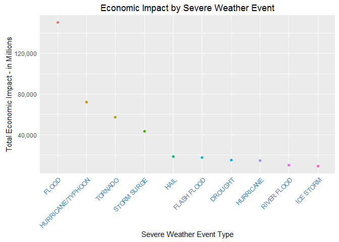

# Severe Weather Event Damage Analysis
Brian Linn  
November 22, 2016  
##Abstract - Synopsis
The following data analysis utilizes information from the National Weather Service  
regarding the impact of severe weather events. From the information, the analysis  
focuses on damage to the population and damage to the population's property.  
The damage to the population, fatalities combined with injuries, is plotted to  
give a visual display of which events cause the most harm. This allows the reader  
to see that Tornadoes cause the most population harm by a signifcant percentage.  
The property damage, which combines property and crop damage from the data, is  
plotted in a similar fashion to give the reader insight into wich events cause  
the most economic damage. Once again, there is a significant outlier in Flood  
damage, which caused more damage than the next two categories, Hurricanes and  
Tornadoes, combined.

## Data Processing - First Question
###Total Population Harm
The data should be loaded into the working directory before running any of the code in the following analysis

The process begins by Clearing any environment variables or stored data

```r
rm(list = ls())
```

Next, the process ensures there is a data folder in the working directory to store the files

```r
if(!exists("./data")){dir.create("./data")}
```

Finally, the data can be loaded into the global environment

```r
#Please note that the rest of the code assumes download of the bz2 file from course assignment to working directory in the data folder, where it is the only file.

#Store the path to the wd data folder
files <- file.path(getwd(),"data/")

#store the bz2 file name
filebz2 <- list.files("./data", pattern = "bz2")

#read the data into R
data <- read.csv(file.path(files, filebz2))
```

Now, we will determine if the mising values in the data can be ignored, or if the  
missing data must be imputed in some fashion.

```r
dataMean <- mean(is.na(data))
```
Since the frequency of missing data for all the data is low, 0.0522974, the  
missing data will be ignored for the remainder of the analysis.

For the analysis of negative effects on population by severe event, the total  
number of injuries and fatalities were combined into the variable HARM. The data  
is then arranged by the total fatalities to allow the analysis to focus on the  
top 10 severe weather events.

```r
#First aggregate all injuries and fatalities by event type, and then sum
data1 <- aggregate(FATALITIES + INJURIES ~ EVTYPE, data, sum, na.rm = TRUE)

#Assign friendly names to variables
colnames(data1) <- c("EVTYPE", "HARM")
```

Next, the data is subset into the top 10 events by harm. The event types are  
turned into a factor to allow for proper arranging on the plots.


```r
#Load the plyr library to allow the arranging of the data frame
library(plyr)
#Arrange the data by total harm, decreasing
data1 <- arrange(data1, data1$HARM, decreasing = TRUE)

#Factor the event type into levels by event type
data1$EVTYPE <- factor(data1$EVTYPE, levels = data1$EVTYPE)

#Extract the top 10 events by total harm
dataPlot <- head(data1, n = 10)
```

## Results - First Question
Finally, the data is plotted to give a visual insight into the harm by event.

```r
#Display data to be plotted
head(dataPlot, n = 10)
```

```
##               EVTYPE  HARM
## 1            TORNADO 96979
## 2     EXCESSIVE HEAT  8428
## 3          TSTM WIND  7461
## 4              FLOOD  7259
## 5          LIGHTNING  6046
## 6               HEAT  3037
## 7        FLASH FLOOD  2755
## 8          ICE STORM  2064
## 9  THUNDERSTORM WIND  1621
## 10      WINTER STORM  1527
```

```r
#load the grammar of graphics plotting library
library(ggplot2)

#assign the base plot to a variable
g <- ggplot(dataPlot, aes(EVTYPE, HARM))

#Call the base plot, add the HARM points, adjust the x-axis labels to fit, remove  
#the legend, and add in appropriate titles and labels, and add commas to y-axis labels.
g + 
        geom_point(aes(color = dataPlot$EVTYPE)) +
        theme(axis.ticks = element_blank()) +
        theme(axis.text.x = element_text(angle = 45, hjust = 1, color = "steelblue")) +
        theme(legend.position = "none") +
        labs(title = "Fatalities and Injuries by Severe Weather Event") +
        labs(x = "Severe Weather Event Type") +
        labs(y = "Total Fatalities and Injuries") +
        scale_y_continuous(labels = scales::comma)
```

<!-- -->
  
The data shows that the Tornado event causes the most total harm by a significant  
amount. In further analysis, it may make sense to further review the split  
between fatalities and death by severe event type as well as total harm.

#Data Processing - Second Question
##Total Economic Damage
Next , the analysis will determine which of the event types caused the most economic  
damage across the country. To do this, the property and crop damage are first  
transformed to like value types and then summed. The top 10 events by damage are  
then plotted to display which events caused the most damage.

```r
#Extract the event type and the damage columns using DMG as described in the 
#data preparation document
data2 <- data.frame(data$EVTYPE, data[, grepl("DMG", names(data))])

#Assign a friendly name to the event type column
colnames(data2)[1] <- "EVTYPE"
```
This section of code creates the covnerter function which allows the indexed  
damage columns to be expanded by the exp index where K = Thousands, M = Millions,  
and B = Billions.

Both the crop and property damage are then run through the function before being  
summed into the total damage column.

```r
#Create function to convert the prop and crop damage to like values
DMGnumConverter <- function(x, y){
        ifelse(x == "K", 1000*y,
               ifelse(x == "M", 1000000*y,
                      ifelse(x == "B", 1000000000*y, 0)))
        
}

#Run the prop and crop damage numbers through the converter and sum as total damage
data2$CROPDMGnum <- DMGnumConverter(data2$CROPDMGEXP, data2$CROPDMG)
data2$PROPDMGnum <- DMGnumConverter(data2$PROPDMGEXP, data2$PROPDMG)
data2$totalDMG <- data2$PROPDMGnum + data2$CROPDMGnum
```


The data is then aggregated by total damage by event type. The summed data is then  
arranged in a descending order, and the event type is turned into a factor for  
plotting. Only the top 10 values are included in the plotted data.

```r
#First aggregate total damage by event type, and then sum
data3 <- aggregate(totalDMG ~ EVTYPE, data2, sum, na.rm = TRUE)

#Load the plyr library to allow the arranging of the data frame
library(plyr)
#Arrange the data by total damage, decreasing
data3 <- arrange(data3, data3$totalDMG, decreasing = TRUE)

#Factor the event type into levels by event type
data3$EVTYPE <- factor(data3$EVTYPE, levels = data3$EVTYPE)

#Extract the top 10 events by total damage
dataPlot3 <- head(data3, n = 10)

#Turn off sceintific notation for ease of reading
options(scipen = 1)

#Reduce the total damage to millions to make displaying the data easier
dataPlot3$totalDMG <- dataPlot3$totalDMG/1000000
```


## Results - Second Question
Finally, the data is plotted to give a visual insight into the economic damage by event.

```r
#Display data to be plotted
head(dataPlot3, n = 10)
```

```
##               EVTYPE   totalDMG
## 1              FLOOD 150319.678
## 2  HURRICANE/TYPHOON  71913.713
## 3            TORNADO  57340.614
## 4        STORM SURGE  43323.541
## 5               HAIL  18752.904
## 6        FLASH FLOOD  17562.129
## 7            DROUGHT  15018.672
## 8          HURRICANE  14610.229
## 9        RIVER FLOOD  10148.405
## 10         ICE STORM   8967.041
```

```r
#load the grammar of graphics plotting library
library(ggplot2)

#assign the base plot to a variable
g3 <- ggplot(dataPlot3, aes(EVTYPE, totalDMG))

#Call the base plot, add the total damage points, adjust the x-axis labels to fit,  
#remove the legend, and add in appropriate titles and labels, and add commas to y-axis 
#labels.
g3 + 
        geom_point(aes(color = dataPlot3$EVTYPE)) +
        theme(axis.ticks = element_blank()) +
        theme(axis.text.x = element_text(angle = 45, hjust = 1, color = "steelblue")) +
        theme(legend.position = "none") +
        labs(title = "Economic Impact by Severe Weather Event") +
        labs(x = "Severe Weather Event Type") +
        labs(y = "Total Economic Impact - in Millions") +
        scale_y_continuous(labels = scales::comma)
```

<!-- -->
  
The data shows that the Flood event causes the most total harm by a significant  
amount. In further analysis, it may make sense to further review the split  
between property and crop damage by severe event type as well as total damage.
